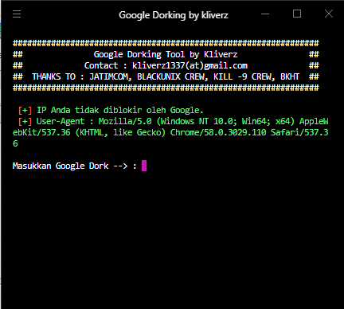
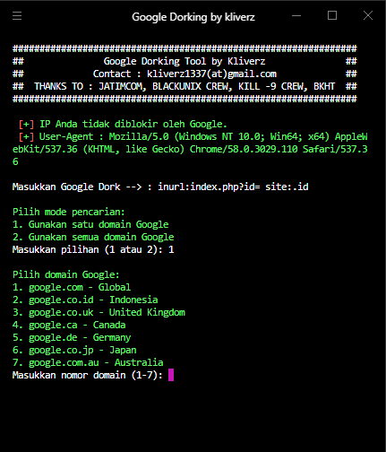
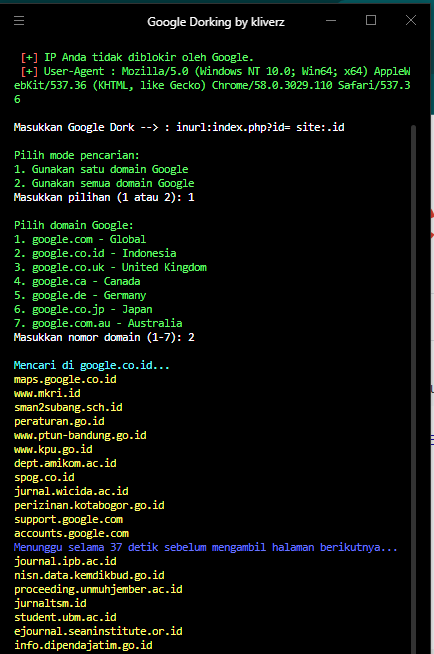

```markdown
# Google Dorking Tool

## Screenshot





Ini adalah alat sederhana yang ditulis dalam Perl untuk melakukan Google Dorking, yaitu teknik pencarian canggih di Google untuk menemukan informasi spesifik di web dengan menggunakan query pencarian yang terperinci.

## Fitur

- **Pengecekan Blokir IP**: Memeriksa apakah IP Anda diblokir oleh Google dengan melakukan request sederhana.
- **Random User Agent** : Setiap request bakal pakai User-Agent yang beda-beda buat mengurangi kemungkinan diblokir..
- **Pencarian Google**: Melakukan pencarian berdasarkan query yang diberikan dan domain Google yang dipilih.
- **Pemilihan Domain**: Memungkinkan pencarian di satu domain Google spesifik atau di semua domain Google yang umum digunakan. Daftar domain dapat dikustomisasi melalui file `google_domains.txt`.
- **Output**: Menyimpan hasil pencarian ke dalam file `google_result.txt` dan menampilkan jumlah domain unik yang ditemukan.
- **Debug Mode**: Terdapat mode debug yang dapat diaktifkan untuk menampilkan informasi tambahan selama proses.

## Prerequisites

Pastikan Anda memiliki Perl terinstal di sistem Anda. Anda juga perlu menginstal beberapa modul Perl yang diperlukan:

- `LWP::UserAgent`
- `HTML::TreeBuilder`
- `URI`
- `Term::ANSIColor`

Jika modul-modul ini belum terinstal, Anda dapat menginstalnya menggunakan `cpan` atau `cpanm`:

```bash
cpan LWP::UserAgent HTML::TreeBuilder URI Term::ANSIColor
```

## Cara Menggunakan

1. **Jalankan Script**:
   Jalankan script Perl ini dari terminal atau command line.

   ```bash
   perl dorking.pl
   ```

2. **Masukkan Query Google Dork**:
   Ketika diminta, masukkan query Google Dork yang ingin Anda gunakan untuk pencarian.

3. **Pilih Mode Pencarian**:
   - Pilih `1` untuk menggunakan satu domain Google.
   - Pilih `2` untuk menggunakan semua domain Google yang umum.

4. **Pilih Domain (jika mode 1)**:
   Jika memilih mode 1, Anda akan diminta untuk memilih domain Google dari daftar yang disediakan.

5. **Tunggu Proses**:
   Script akan melakukan pencarian dan menyimpan hasilnya ke dalam file `google_result.txt`. Juga akan menampilkan domain-domain unik yang ditemukan di konsol.

6. **Cek Hasil**:
   Setelah proses selesai, Anda dapat memeriksa file `google_result.txt` untuk melihat hasil pencarian.

## Contoh Penggunaan

```bash
perl dorking.pl
```

- Masukkan query seperti `site:example.com "confidential"`.
- Pilih mode pencarian dan domain sesuai kebutuhan.
- Tunggu hingga proses selesai dan cek file `google_result.txt` untuk hasil pencarian.

## Peringatan

- Gunakan alat ini dengan bijak dan sesuai dengan kebijakan serta peraturan Google.
- Jangan gunakan alat ini untuk melakukan scraping berlebihan atau merusak layanan Google.

## Kontak

Jika Anda memiliki pertanyaan atau masalah, Anda dapat menghubungi saya di [kliverz1337(at)gmail.com](mailto:kliverz1337@gmail.com).

## Terima Kasih

Terima kasih kepada JATIMCOM, BLACKUNIX CREW, KILL -9 CREW, dan BKHT untuk dukungan dan kontribusinya.

---

**Catatan**: Script ini hanya untuk tujuan pendidikan dan penelitian. Pastikan untuk mematuhi kebijakan penggunaan dan hukum yang berlaku saat menggunakan alat ini.
